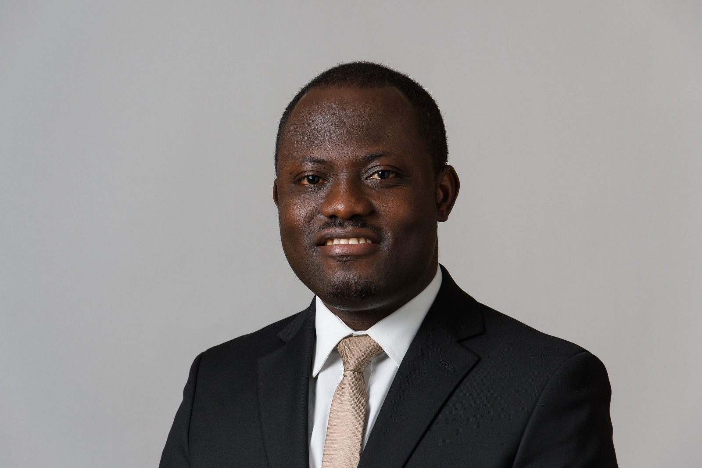
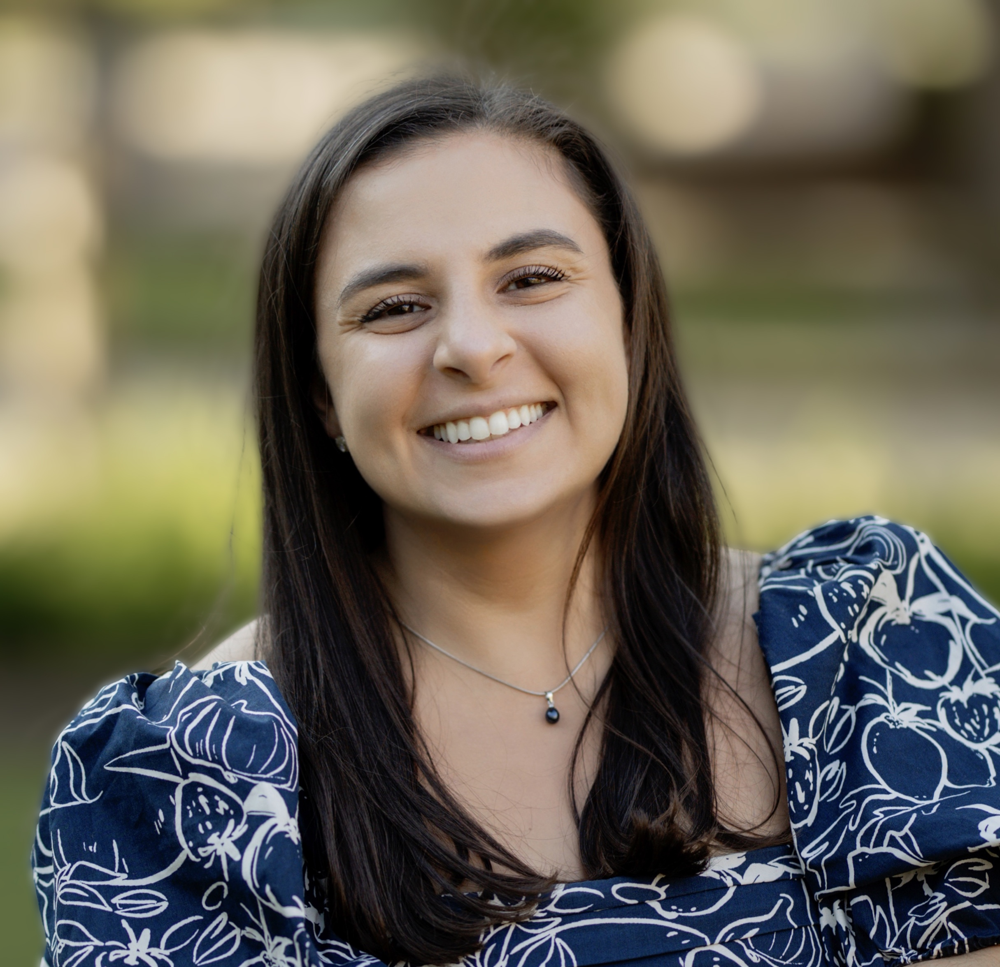
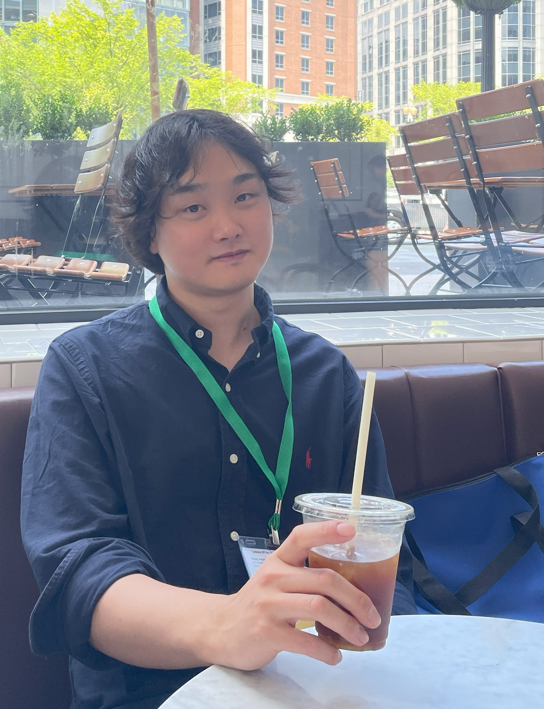

## YINI ZHANG (CO-DIRECTOR)

Yini Zhang (Ph.D., University of Wisconsin-Madison) is an assistant professor in the Department of Communication at the University at Buffalo. She applies computational methods to the study of social media and emerging communication technologies. Specifically, she examines the processes and outcomes of primarily political communication within and beyond different corners of the new media landscape. Her work has been published in leading communication journals such as *Journal of Communication*, *Journal of Computer-Mediated Communication*, and *New Media & Society*. Her research has been supported by funders like the National Science Foundation and the Knight Foundation and received media coverage from major news outlets like the New York Times, BBC, and USA TODAY.

contact: [yzhang20@buffalo.edu](yzhang20@buffalo.edu)

## JIYOUN SUK (CO-DIRECTOR)

Jiyoun Suk (Ph.D., University of Wisconsin-Madison) is an Assistant Professor in the Department of Communication at the University of Connecticut. In her research, she looks at how the communication processes in the contemporary media environment shape social trust, activism, and political polarization, primarily employing computational methods. In particular, she is interested in how people understand different social groups marginalized communities. Her primary line of research examines the role of networked communications in bringing out voices of social justice and equality, as in the case of the #MeToo movement. She currently looks at how digital activism is contextualized across specific geographies and social media platforms.

contact: [jiyoun.suk@uconn.edu](jiyoun.suk@uconn.edu)

## NOJIN KWAK (CO-DIRECTOR)

Nojin Kwak (Ph.D., University of Wisconsin-Madison) is a professor in the Department of Communication at the University at Buffalo (UB), State University of New York. In addition, he currently serves as Vice Provost for International Education at UB. Kwak’s research centers on the role of communication media in civic and political engagement, and his recent studies analyze the impact of social media on community involvement, deliberative openness, and political participation. Kwak’s work has been published in top journals in the field, including *Communication Research*, *Journal of Communication*, *Human Communication Research*, *New Media and Society*, *Journal of Computer-Mediated Communication*, *Political Communication*, and *Political Research Quarterly*, and he has received numerous top paper awards at major conferences. Previously, Kwak was a professor and chair of the Department of Communication and Media at the University of Michigan.

contact: [njkwak@buffalo.edu](njkwak@buffalo.edu)

<!-- ## AFOLABI FRANCA -->

## YIJIN GUO

Yijin Guo is a Ph.D. student in the Department of Communication at the University at Buffalo. His research interests mainly focus on media effects, misinformation, and digital risks. His current work investigates misinformation interventions across different channels through surveys and experiments, and uses computational methods to examine social media discussions related to digital risks such as online scams.

## JAMES KWARTENG

James Kwarteng is pursuing his Ph.D. in Communication at the University of Connecticut. He holds a master's degree in communication from Eastern New Mexico University and a bachelor’s in English from Kwame Nkrumah University of Science and Technology. Before his Ph.D. at the University of Connecticut, James was the Radio Station and Social Media Manager of Eastern New Mexico University's Hound Waves Radio. He managed social media websites and designed a mobile app for Hound Waves Radio. His research interests revolve around social media, interactive media, and computational methods.

## TAHLEEN LATTIMER

Tahleen Lattimer (PhD, University at Buffalo) is a postdoctoral research fellow at the Center for Disability Health & Wellness in the Department of Physical Medicine & Rehabilitation at Michigan Medicine, University of Michigan. Her research examines the intersection of health and media, with a focus on addressing the needs and experiences of disability populations across the lifespan.

## YI YIN LEONG

Yi Yin Leong is currently a Presidential Ph.D. Fellow in the Department of Communication at the University at Buffalo. Her research focuses on health and risk communication, specifically among women and LGBTQ+ populations. She hopes to contribute and advance the current scholarship, and offer insights into the lives of marginalized and disadvantaged communities.

## LILI ROMANN

Lili R. Romann (M.A., University of Connecticut) is a doctoral student at the UConn. Her research lies at the nexus of interpersonal health and computer-mediated communication. She studies health information-seeking processes, especially related to mental health communication, processes of health inquiry, sensitive self-disclosure, and self-diagnosis on social media. She is additionally passionate about promoting the importance safe and effective social media experiences, specifically in fostering democratic collaborations between user and platform in our algorithm-driven online world. She has served as a graduate assistant for the Department of Communication; Women’s, Gender, & Sexuality Studies Program; and the Department of Journalism.

## JUNWAN SEO

Junwan Seo is a Ph.D. student in the Department of Communication at the University at Buffalo. His research focuses on media uses and effects, narrative effects, and computational social science. He is especially interested in the effects of emotional experiences and different narrative components such as storyline, characters, and visual features.

## CHAEYEON “CELINE” YIM

Celine Yim is a Ph.D. student in the Department of Communication at the University of Connecticut, where she studies health communication and emerging technologies. She is also a communication assistant for the Technical Assistance to Brownfields Program in New England. Her research interest lies in health issues of stigmatized diseases and vaccines and environmental health issues like PFAS and brownfields through experimental designs and computational methods. She also explores human-AI interaction in various domains, such as healthcare, business, and education.

  <h2 id="alumni-network">ALUMNI NETWORK</h2>
  &#x25BC;

## ZHIYING YUE 

Zhiying Yue (Ph.D., University at Buffalo) was a research assistant in the CEM lab. She currently is a Scientist at the Digital Wellness Lab at Boston Children's Hospital and an Instructor in Pediatrics at Harvard Medical School. Her work focuses on adolescents' interactive media use and well-being.

## XINXIA DONG

Xinxia Dong (Ph.D., University at Buffalo) is currently a Lecturer in the School of Journalism and Communication at Shanghai University. Her research focuses on risk communication. 

## EMMA BENNETT

Emma Bennett (BA, University at Buffalo) is an MA student in the Parsons School of Design. 

## DONGDONG YANG

Dongdong Yang (Ph.D., University of Connecticut) is an assistant professor in the School of Communication and Media at Montclair State University. She is primarily interested in digital media adoption and effects in cross-cultural communication, feminist media studies, and online political discussion. 

## SARA HOLLAND LEVIN

Sara Holland Levin (Ph.D., University of Connecticut) is an assistant professor of Media and Culture in the Department of Communication and Media at West Chester University of Pennsylvania. Her research focuses on political communication on social media, with a particular focus on politicization and polarization of attitudes. Sara is especially interested in how people process misinformation on social media through a political lens, and is passionate about examining these research questions from a computational perspective. At the University of Connecticut, Sara specializes in teaching digital production coursework. 

## RUI WANG

Rui Wang (Ph.D., University at Buffalo) is an assistant professor in the Department of Communication and Media at Loyola University Maryland. Her research focuses on media effects and persuasion, combining computational methods with experimental and survey designs. She is particularly interested in how new technology applied to journalism reshapes public perception. She is also interested in the effect of social media discussion on public attitudes and attention on health and politics. 

