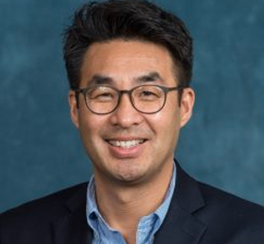
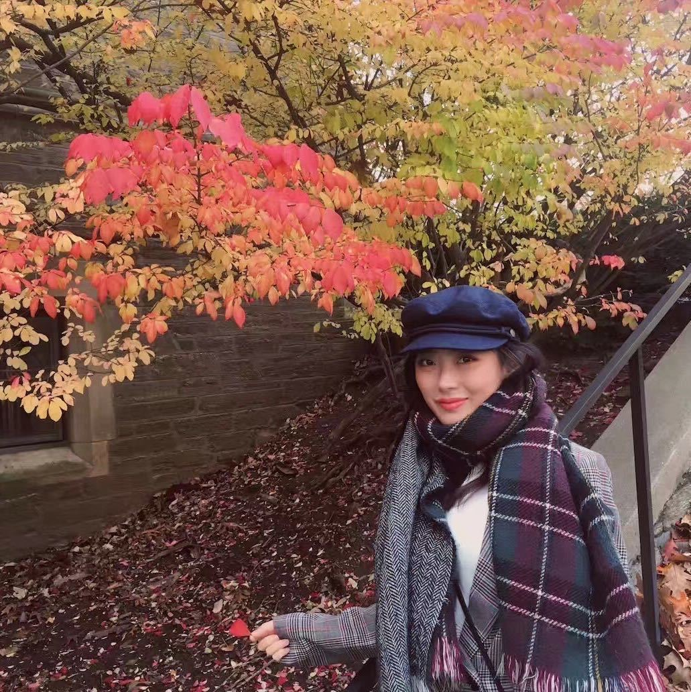
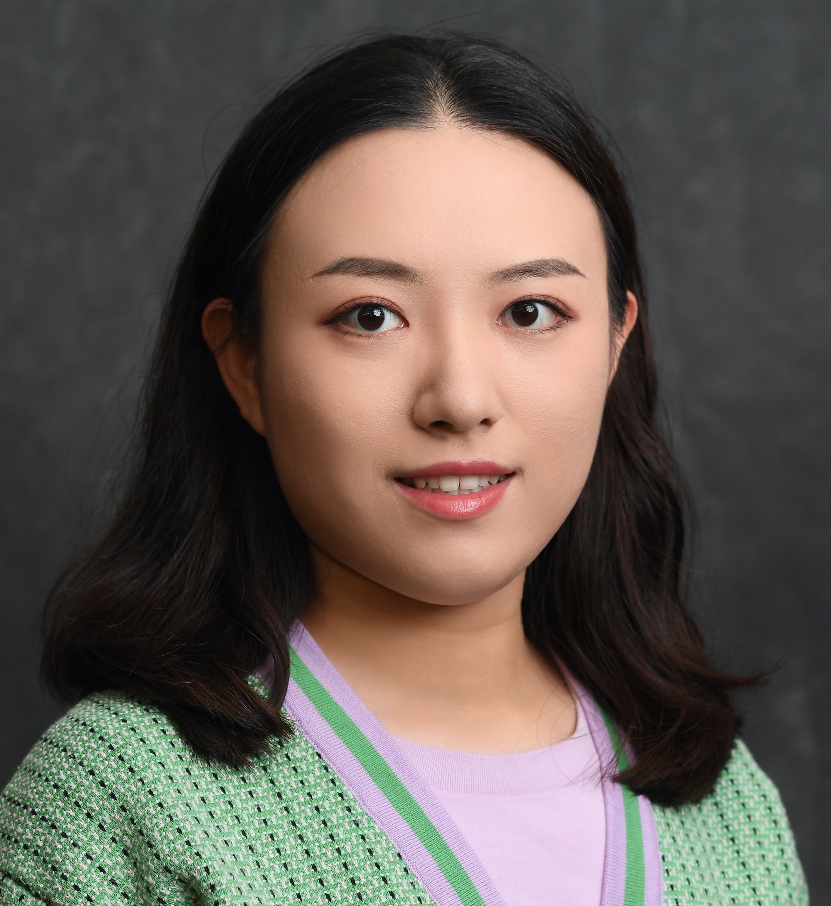

<link rel="stylesheet" href="styles.css" type="text/css">

<!-- --- -->
<!-- title: "People" -->
<!-- --- -->

## Nojin Kwak (co-director)

Nojin Kwak (Ph.D., University of Wisconsin-Madison) is a professor in the Department of Communication at the University at Buffalo (UB), State University of New York. In addition, he currently serves as Vice Provost for International Education at UB. Kwak’s research centers on the role of communication media in civic and political engagement, and his recent studies analyze the impact of social media on community involvement, deliberative openness, and political participation. Kwak’s work has been published in top journals in the field, including *Communication Research*, *Journal of Communication*, *Human Communication Research*, *New Media and Society*, *Journal of Computer-Mediated Communication*, *Political Communication*, and *Political Research Quarterly*, and he has received numerous top paper awards at major conferences. Previously, Kwak was a professor and chair of the Department of Communication and Media at the University of Michigan.

contact: [njkwak@buffalo.edu](njkwak@buffalo.edu)

## Yini Zhang (co-director)

Yini Zhang (Ph.D., University of Wisconsin-Madison) is an assistant professor in the Department of Communication at the University at Buffalo. She applies computational methods to the study of networked actors on social media, information flows across traditional and social media, and their implications for journalism and democracy. Her work has been published in journals such as *Journal of Communication*, *Journal of Computer-Mediated Communication*, and *New Media & Society*.

contact: [yzhang20@buffalo.edu](yzhang20@buffalo.edu)

## Zhiying Yue (research assistant)

Zhiying Yue is a doctoral candidate in the Department of Communication at the University at Buffalo. She researches social media use and its impact on psychological and physical well-being.

## Rui Wang

Rui Wang is a current Ph.D. student in the Department of Communication at the University of Buffalo, earned her M.A. in Information and Communication Studies at Rutgers University. Her research focuses on media effects and persuasion, combining computational methods with experimental and survey designs. She is particularly interested in how new technology applied to journalism reshapes public perception. She is also interested in the effect of social media discussion on public attitudes and attention on health and politics. She had three-year teaching experience in the School of Journalism and Communication at Anhui Normal University.

## Xinxia Dong

Xinxia Dong (M.A., Renmin University of China) is pursuing her Ph.D. in the Department of Communication at the University at Buffalo. Xinxia's academic interests lie in risk communication and social media. Her current published work primarily examines the risk information seeking and processing (RISP) model. She is also passionate about exploring emerging media and learning various computational methods.

