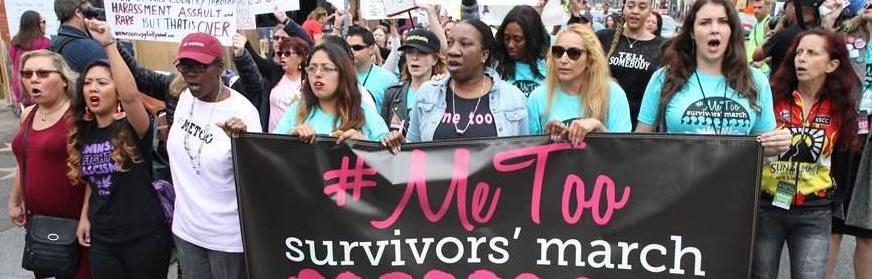

<!-- --- -->
<!-- title: "Projects" -->
<!-- --- -->

## On-going

### Mapping the social media ecosystem

This project seeks to map out an ecosystem of social media that features both differentiation and interconnectedness. We focus on social media digital architecture, news media participation, and users' repertoire of social media applications. Using the embedded links in the posts as well as the content that embedded the links, we examine how information flows across different social media platforms using two case studies. 

### Keyword selection for social media data collection

For research on social media discourses, the keywords used to retrieve related social data content can greatly influence the findings. This project examines existing keyword selection practices in social media data collection and proposes a word-graph based snowball sampling approach for keyword selection.

### The politicization and polarization of the #MeToo movement

This project examines the composition of participants in the #MeToo movement and the discourses originating from them over time on Twitter. We seek to find whether the politically motivated participants crowded out moderates and used this movement as weapons in partisan arguments. 

### The 2020 US presidential election study

By conducting a two-wave panel study, we plan to examine how traditional and social media consumption influences people's political beliefs and engagement.

## Completed:

### Accumulation of influence on social media

Though the use of social media by peripheral groups in society has received rising scholarly attention, it remains unclear how social media might contribute to their increased influence and how their social media activity evolves over time. In this project, we study actors’ strategic performance on social media, social media audience’s reaction, and news media amplification of their strategic performance, all of which might fuel each other to catapult peripheral actors to prominence. 

Through an analysis of 242 QAnon Twitter accounts using topic modeling and time series modeling, we find that QAnon accounts performed their group identity that helped them attract social media audience reaction, which in turn reinforced their group identity-based performance and drove news media amplification. These results highlight the implications of social media and news media for the normalization of peripheral actors and ideologies.

### #MeToo cross-platform discourses

This project situates our analysis in discourses on sexual violence and gender justice activism on Twitter, Facebook, Instagram, and Reddit. We propose a three-pronged framework to understand discourses surrounding social media activism initiated by networked counterpublics: personal expression that raises public consciousness and fosters social support, calls to action that demand social changes, and contention that can either invigorate or stymie action. We use supervised machine learning to classify three discourses (networked acknowledgement, calls to action, and feminism contention) and apply time series analysis to model their interrelations. 

Results show that networked acknowledgment stimulates both calls to action and feminism contention and that calls to action predicts feminism contention across all platforms. Also, these discourses were more sensitive to various events on Twitter and Facebook, but more ephemeral and cyclical on Instagram and more persistent and mutually reinforcing on Reddit. These findings underscore the opportunities and challenges in social media activism and articulate cross-platform similarities and differences. 