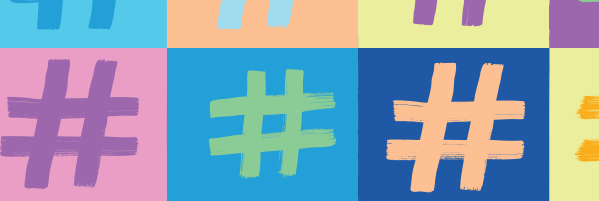

## Project #1 Crossplatform information flow

This project concerns how people talked about the #MeToo movement across different social media platforms and investigates how different discourses spread across Twitter, YouTube, Instagram, & Facebook. 

## Project #2 Information diffusion on social media

This project examines how different hashtags related to immigration spread between 2012-2020. We take into account the different characteristics of hashtags, the networks of users who spread them, and the linguistic features of tweets associated with the hashtags. 

## Project #3 Accumulation of influence on social media

This projects studies how QAnon believers used Twitter and whether they were able to grew their influence on Twitter. Specifically, we investigate the media use and media uptake of Twitter users who declared themselves to be QAnon believers; and we link their Twitter activity to their follower growth. This project is aimed at understanding this community and its growth, as seen on Twitter and news media. 