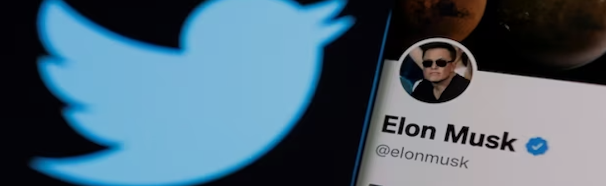

<!-- --- -->
<!-- title: "Projects" -->
<!-- --- -->

## On-going

### Elon Musk and Twitter

With social media platforms increasingly sinking into nearly all aspects of society (Van Dijck, 2021) and concerns over the spread of mis- and dis-information on various platforms (Grinberg et al., 2019), platform governance has come to public, media, and academic spotlight in recent years. Platform governance involves multiple players, including “platform companies, users, advertisers, governments, and other political actors” (Gorwa, 2019). In particular, some platforms are significantly tied to their owners, like Mark Zuckerberg of Facebook, Jack Dorsey of Twitter, and Donald Trump of Truth Social. Most recently, Elon Musk’s takeover of one of the most influential platforms, Twitter, has ignited debates about privatization of public sphere, content moderation (and restoration of controversial accounts), and their political consequences. This raises questions about the role that a single person can/should have in impacting public discourse on a platform. Building on platform governance (Van Dijck & Poell, 2013) and social media public opinion (Zhang et al., 2022) scholarship, we conceptualize social media discourses surrounding platform governance as an expression of public opinion and an object with business impact. By examining how platform ownership change might impact the intensity of, engagement with, and topics in platform governance discourses, we seek to contribute to our understanding of how the democratic and capitalist aspects of platforms are intertwined.  

### Mapping the social media ecosystem

With existing cross-platform research focusing primarily on differences between social media platforms, we focus on cross-platform interconnectedness by examining information flow across a range of social media platforms. Our typology of social media platforms includes two dimensions: 1) whether a given platform is a connectivity-focused social network site or an information-focused forum, and 2) whether it caters to generic or niche demographics. Treating hyperlinks embedded in the posts of a given platform as bridges to other platforms or information sources, we analyze hyperlinks in the posts of 188 social media platforms in the a) immigration discourse and b) the sexual violence and /gender justice discourse spanning multiple years. Preliminary findings show that the majority of hyperlinks went to news sites and mainstream social media sites. In particular, YouTube was the most heavily linked social media site and content from far-right news sites flowed voluminously to niche social media sites and generic online forums. 

### The politicization and polarization of the #MeToo movement

With existing research showing the fragilities of social media activism and the stubbornness of partisan beliefs and attitudes, we examine whether partisans politicize social media activism. Politicization is conceptualized as partisans crowding out non-partisan participants, dominating conversations and debates, and weaving selective events into narratives. Our large-scale and multi-layered computational analysis of discourses surrounding the #MeToo movement is based on a comprehensive list of related accusations and a vast corpus of all #MeToo tweets. Through cluster analysis of the retweet network, we identified different groups and found that partisan users accounted for the overwhelming majority of the tweets. In the next step, we will apply supervised machine learning to classify different expressions and use time series modeling to examine the relationship between features of accusations and types of expressions.

## Completed:

### #MeToo cross-platform discourses

This project situates our analysis in discourses on sexual violence and gender justice activism on Twitter, Facebook, Instagram, and Reddit. We propose a three-pronged framework to understand discourses surrounding social media activism initiated by networked counterpublics: personal expression that raises public consciousness and fosters social support, calls to action that demand social changes, and contention that can either invigorate or stymie action. We use supervised machine learning to classify three discourses (networked acknowledgement, calls to action, and feminism contention) and apply time series analysis to model their interrelations. 

Results show that networked acknowledgment stimulates both calls to action and feminism contention and that calls to action predicts feminism contention across all platforms. Also, these discourses were more sensitive to various events on Twitter and Facebook, but more ephemeral and cyclical on Instagram and more persistent and mutually reinforcing on Reddit. These findings underscore the opportunities and challenges in social media activism and articulate cross-platform similarities and differences. 

### Accumulation of influence on social media

Though the use of social media by peripheral groups in society has received rising scholarly attention, it remains unclear how social media might contribute to their increased influence and how their social media activity evolves over time. In this project, we study actors’ strategic performance on social media, social media audience’s reaction, and news media amplification of their strategic performance, all of which might fuel each other to catapult peripheral actors to prominence. 

Through an analysis of 242 QAnon Twitter accounts using topic modeling and time series modeling, we find that QAnon accounts performed their group identity that helped them attract social media audience reaction, which in turn reinforced their group identity-based performance and drove news media amplification. These results highlight the implications of social media and news media for the normalization of peripheral actors and ideologies.
