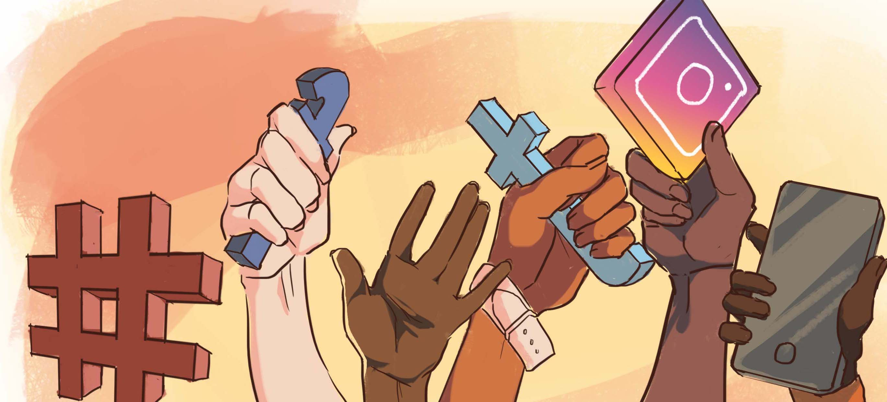

## Project #1 Crossplatform information flow

This project concerns how people talked about the #MeToo movement across different social media platforms and investigates how different discourses spread across Twitter, YouTube, Instagram, & Facebook. 

## Project #2 Accumulation of influence on social media

This project studies how QAnon believers used Twitter and whether they were able to grow their influence on Twitter. Specifically, we investigate the social media use and news media uptake of Twitter users, who claimed to be QAnon believers; and we link their Twitter activity to their follower growth. This project seeks to understand this community and its growth, as seen on Twitter and news media. 

## Project #3 Social media activism

This project investigates the power of #BlackLivesMatter, #MeToo, and #StopAsianHate movements on Twitter by focusing on the participants. We examine how they participated in the three movements and to what extent they channeled their attention from one movement to another. 

## Project #4 The 2020 US presidential election study

By conducting a two-wave panel study, we plan to examine how traditional and social media consumption influences people's political beliefs and engagement.

